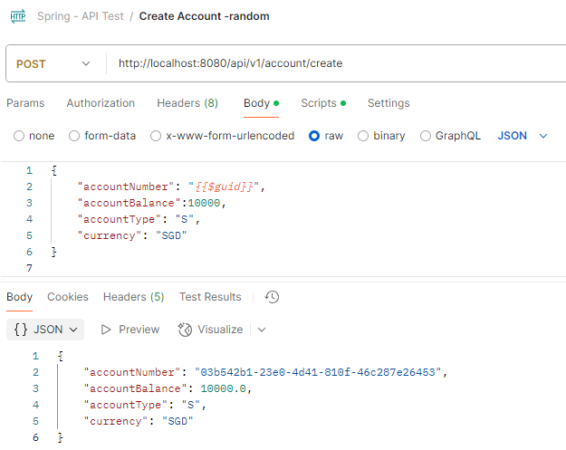

The repository contains code that was taught in the course "Spring based REST APIs for Advanced Financial Server Open Banking"

The course was taught by Deepan.

The repository is divided into 2 modules:

1. Module 1: Spring Boot Basics in module sprint_intro
2. Module 2: Account rest APIs in module webexample

### Module 1: Spring Boot Basics (spring_intro)
Below is the flow of the course: 
- simple
- simpleinterface
- factory
- config
- annot

### Module 2: Account rest APIs (webexample)
The source code doesnt exactly follow what Deepan taught in the course.
I used the course as a reference and implemented the code on my own with the help of GitHub Copilot and other web references.

I think this is a good reference to recap the course taught.

#### Testing the APIs
You can use postman to test the APIs.  See a sample below: 

### Need help?
Any questions please reach out to me.
